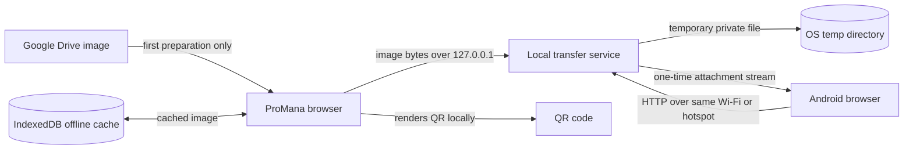

# Offline QR Image Download

ProMana can send a stored JPG, JPEG, PNG, GIF, or WebP image from the desktop browser to an Android phone on the same local network. The QR code is generated in the browser and contains only a private-LAN HTTP address such as:

```text
http://192.168.1.25:47832/t/<random-session-id>?token=<random-one-time-token>
```

The transfer does not upload the image or QR payload to Vercel, Firebase, Google Drive, a QR provider, or any other remote service.

## Why a local companion is required

A normal browser tab cannot safely open a listening HTTP port for a phone. ProMana therefore uses a small Node.js companion process. The browser controls it only through `127.0.0.1:47832`; the companion serves the one-time receiver page and image on the computer's private IPv4 LAN address.



The Drive arrow is not part of the phone transfer. An image uploaded through this browser is cached locally after upload. An older uncached image needs one online preparation from Drive; after that preparation succeeds, QR creation and phone download use only the LAN. Browser storage policies or quota limits can prevent caching, and the UI reports this honestly. Offline copies expire after 30 days, are cleared when that ProMana account logs out, and can be removed immediately with `Clear offline copies`.

## Run locally

Prerequisites: Node.js `20.19+` or `22.12+` and npm.

1. Install dependencies:

   ```powershell
   npm install
   ```

2. Start ProMana in the first terminal:

   ```powershell
   npm run dev
   ```

3. Start the local companion in a second terminal:

   ```powershell
   npm run offline-transfer
   ```

4. Open `http://localhost:3000`, enter Docs & Images, and click `Check Offline QR service`. This explicit action is when the browser can ask for Local Network Access permission. After allowing it, confirm the badge changes to `Offline QR service ready`.

The V1 UI and companion use fixed port `47832`. Keep both terminals and the ProMana tab open until the download completes.

### Hosted ProMana origin

The companion accepts only the local development origins by default. To use a trusted deployed ProMana origin, allow its exact origin before starting the companion:

```powershell
$env:PROMANA_OFFLINE_ALLOWED_ORIGINS = "https://your-promana-domain.example"
npm run offline-transfer
```

Do not add wildcard origins. Browsers can require [Local Network Access permission](https://developer.chrome.com/blog/local-network-access/) before a hosted page can contact a loopback/private-network service. A locally served ProMana tab is the most reliable configuration for a deliberately offline workflow.

## Use the feature

1. In Docs & Images, locate an image card.
2. Click its QR icon. The action is intentionally unavailable for documents and while the local companion is unavailable.
3. If multiple physical network adapters are shown, choose the Wi-Fi, Ethernet, or hotspot address shared with the phone.
4. Wait for `Ready for scan`.
5. Scan the QR code with Android Camera or Google Lens, open the local address, and tap `Download image`.
6. Keep the modal open until it reports `Download complete`.

Closing the modal cancels the session. A session expires after 10 minutes and can download successfully only once.

## Exact offline acceptance test: Windows to Android

1. Put the Windows computer and Android phone on the same non-guest Wi-Fi network, or connect the computer to the phone's hotspot.
2. In Windows Settings, set that connection's network profile to `Private`.
3. Start ProMana and the companion with the commands above. If Windows Defender Firewall prompts for Node.js, allow it on `Private networks` only.
4. While internet access is available, upload an image in this browser or open Offline QR for an existing image once so it enters the browser cache. Close the QR modal after preparation.
5. Disable the router's WAN connection, or otherwise disconnect internet access without disconnecting the local Wi-Fi/hotspot. Disable mobile data and VPN on Android.
6. Open Offline QR for the cached image, scan it, open the local HTTP page, and download the image.
7. Confirm the original filename and byte size in Android Downloads. For an exact integrity check, connect Android Debug Bridge and run:

   ```powershell
   adb pull "/sdcard/Download/<filename>" .
   Get-FileHash -Algorithm SHA256 ".\<filename>"
   Get-FileHash -Algorithm SHA256 ".\path\to\original-image"
   ```

8. Try the same download URL again. It must report that the one-time transfer has already completed.

If Android cannot connect, verify the phone is not on guest Wi-Fi, the two devices have compatible private IPv4 addresses, VPN is off, and Node.js is allowed through the private firewall profile.

## Exact offline acceptance test: macOS to Android

1. Put the Mac and Android phone on the same non-guest Wi-Fi network, or use the phone's hotspot.
2. Start ProMana and the companion. If macOS asks, allow Node.js to accept incoming connections under System Settings > Network > Firewall > Options.
3. Confirm the Mac's Wi-Fi IPv4 address and listener:

   ```bash
   ipconfig getifaddr en0
   lsof -nP -iTCP:47832 -sTCP:LISTEN
   ```

4. Prepare/cache the image once while online, then remove WAN access without turning off the shared Wi-Fi/hotspot. Disable Android mobile data and VPN.
5. Generate a new QR, scan it, and download from the local page.
6. Optionally compare exact bytes:

   ```bash
   adb pull "/sdcard/Download/<filename>" .
   shasum -a 256 "<filename>" "/path/to/original-image"
   ```

## Security properties

- Session IDs use 128 bits of cryptographic randomness; access tokens use 256 bits.
- Only a SHA-256 token digest is used for validation, with timing-safe comparison. Tokens and filenames are never logged.
- The control API requires a loopback client, exact loopback `Host`, and an allowlisted browser `Origin`.
- The QR receiver accepts only the random session ID and token. Invalid tokens return generic responses and are rate limited.
- Uploads are limited to 25 MiB and to JPEG, PNG, GIF, or WebP. File signatures are checked instead of trusting only extensions or MIME headers.
- Filenames are sanitized before use in download headers. URL paths never select filesystem paths.
- Staged bytes use a randomly named, private OS temporary directory and a mode-`0600` file where the platform supports permissions.
- Downloads are streamed; the service does not load an additional full image copy into memory.
- Cancellation, expiry, successful transfer, and orderly service shutdown remove staged bytes. Terminal session metadata remains briefly so the sender and receiver can see an accurate result. A successful later startup also removes abandoned ProMana transfer directories older than 24 hours after a crash or forced shutdown.
- Receiver pages contain inline local HTML/CSS only, use a restrictive Content Security Policy, and set `no-store`, `nosniff`, and `no-referrer` headers.

The receiver uses HTTP, not TLS. The strong unguessable token protects the URL, but local network traffic is not encrypted. Use a trusted private LAN or a personal hotspot, and do not share screenshots of the QR code.

The browser also trusts the ProMana companion process listening on fixed loopback port `47832`. Protocol/version checks detect accidental port conflicts, but they are not a defense against malware already running as the desktop user and deliberately impersonating the companion. Stop if the UI reports an incompatible service, run only the companion from this repository, and treat local-device compromise as outside this feature's security boundary.

## Automated checks

```powershell
npm test
npm run lint
npm run build
```

The transfer tests cover credential randomness and validation, rate limiting, filename and image-signature safety, private-adapter selection, size limits, exact-origin/PNA CORS, protocol compatibility, exact bytes and download headers, concurrent creation, one-time use, invalid tokens and paths, cancellation, expiry, and temporary-file cleanup.

## Known limitations

- The Node.js companion must be running, and the ProMana tab must remain open during staging and status reporting.
- ProMana is not currently an offline-installed PWA. Keep the already loaded tab open; reloading the whole app without internet can fail because its app/auth/Firestore data are still web-hosted.
- A previously uncached Drive image needs internet once. If IndexedDB is unavailable or full, or the 30-day cached copy has expired, it cannot be reused offline later.
- Guest Wi-Fi client isolation, corporate firewall rules, VPNs, some mesh networks, or missing private IPv4 connectivity can block peer-to-peer LAN access.
- Android may warn before opening a local `http://` address. The receiver page cannot silently bypass browser security prompts.
- The browser controls the Android download location. ProMana can request the correct attachment filename but cannot guarantee that it appears directly in the Gallery instead of Downloads.
- Downloads are strict one-shot streams and do not support HTTP Range/resume. If a connection is interrupted, create a new QR session.
- Only one image transfer is active at a time. Starting another transfer cancels the earlier active session.
- There is deliberately no cloud fallback.
